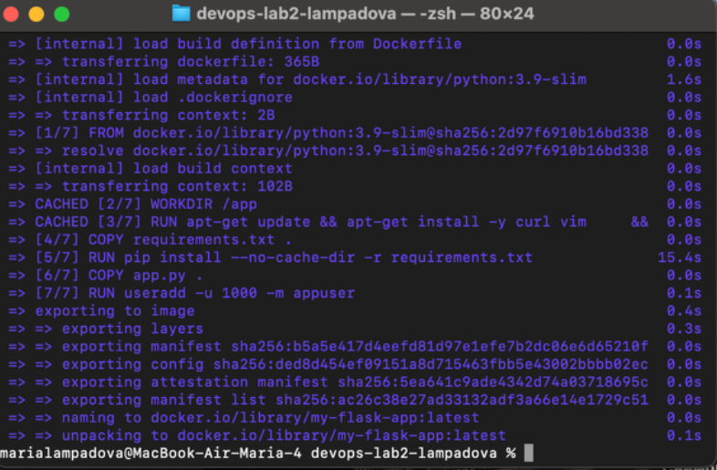
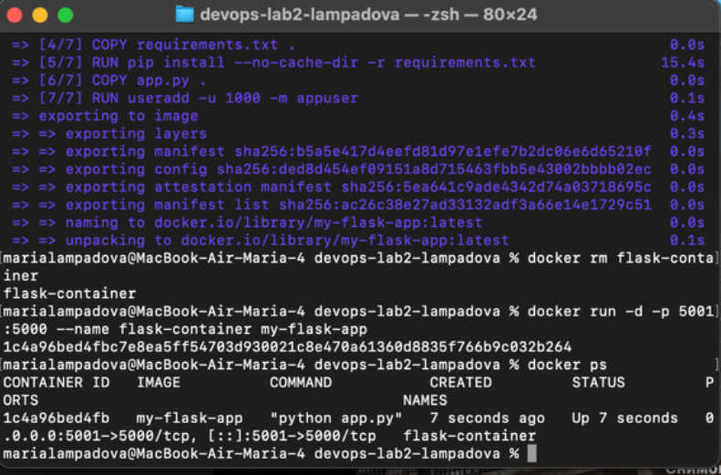
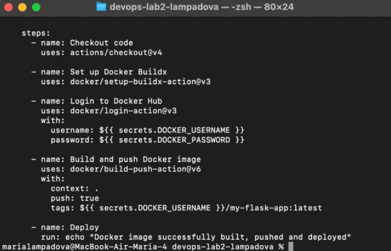
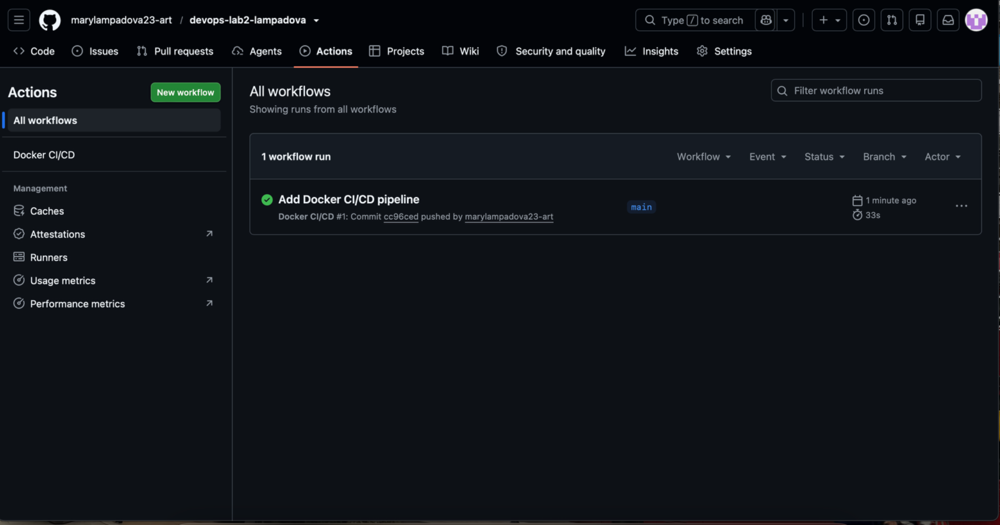
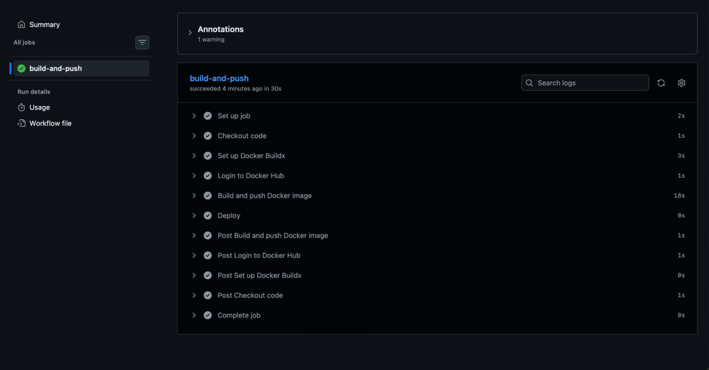
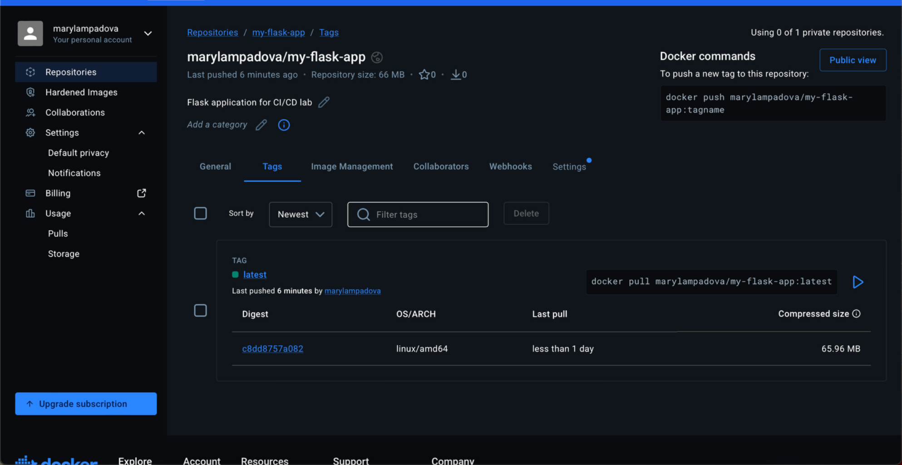

University: [ITMO University](https://itmo.ru/ru/) 
Faculty: [FICT](https://fict.itmo.ru) 
Course: [Введение в веб технологии](https://itmo-ict-faculty.github.io/introduction-in-web-tech/) 
Year: 2026/2027 
Group: ВвВТ УВБ 3.1 
Author: Лампадова Мария Витальевна 
Lab: Lab2 
Date of create: 07.09.2026 
Date of finished:

# Лабораторная работа №2. CI/CD для Docker приложения

## Цель работы

Изучить настройку CI/CD пайплайна с использованием GitHub Actions для автоматической сборки Docker-образа, его публикации в Docker Hub и выполнения шага деплоя при изменении кода.

## Ход работы

### 1. Подготовка Docker-приложения

Для лабораторной работы был создан новый GitHub-репозиторий devops-lab2-lampadova.

В проект были добавлены следующие файлы:

- app.py — Flask-приложение;
- requirements.txt — список Python-зависимостей;
- Dockerfile — инструкция для сборки Docker-образа.

В requirements.txt были зафиксированы версии зависимостей:

Flask==2.0.1

Werkzeug==2.0.3

Версия Werkzeug была зафиксирована для обеспечения совместимости с Flask 2.0.1.

Docker-образ был локально собран командой:

docker build -t my-flask-app .

После сборки был запущен контейнер. Так как порт 5000 на локальном компьютере был занят системным процессом macOS, для проверки использовался внешний порт 5001:

docker run -d -p 5001:5000 --name flask-container my-flask-app

Работа приложения была проверена командой:

curl http://localhost:5001

В результате было получено сообщение:

Hello from Docker!

### 2. Настройка Docker Hub

На Docker Hub был создан репозиторий:

marylampadova/my-flask-app

Для безопасной авторизации GitHub Actions в Docker Hub был создан Personal Access Token с правами Read & Write.

### 3. Настройка GitHub Secrets

В настройках GitHub-репозитория были соз Настройка GitHub Secrets

В настройках GitHub-репозитория были созданы два секрета:

- DOCKER_USERNAME — имя пользователя Docker Hub;
- DOCKER_PASSWORD — Personal Access Token Docker Hub.

Использование GitHub Secrets позволяет не хранить логин и токен непосредственно в файле CI/CD-пайплайна.

### 4. Настройка GitHub Actions

В корне проекта была создана папка:

.github/workflows/

В ней был создан файл:

docker-build.yml

Пайплайн настроен на автоматический запуск при каждом push в ветку main.

В пайплайне выполняются следующие этапы:

1. Checkout исходного кода.
2. Настройка Docker Buildx.
3. Авторизация в Docker Hub с использованием GitHub Secrets.
4. Сборка Docker-образа.
5. Публикация образа marylampadova/my-flask-app:latest в Docker Hub.
6. Выполнение условного шага Deploy.

### 5. Тестирование CI/CD пайплайна

После выполнения commit и push в ветку main автоматически запустился GitHub Actions workflow Docker CI/CD.

Выполнение пайплайна завершилось успешно.

Все основные этапы получили успешный статус:

- Checkout code;
- Set up Docker Buildx;
- Login to Docker Hub;
- Build and push Docker image;
- Deploy.

После завершения пайплайна в Docker Hub появился образ:

marylampadova/my-flask-app:latest

Таким образом, публикация Docker-образа выполняется автоматически после изменения кода и push в ветку main.

## Вывод

В ходе лабораторной работы был настроен CI/CD-пайплайн с использованием GitHub Actions. Была реализована автоматическая сборка Docker-образа, безопасная авторизация в Docker Hub через GitHub Secrets, публикация образа в Docker Hub и условный этап деплоя. Работа пайплайна была успешно проверена после push в ветку main.

## Скриншоты выполнения работы

### Локальная сборка Docker-образа

### Запуск и проверка контейнера

### Настройка workflow GitHub Actions

### Успешный запуск GitHub Actions

### Успешное выполнение всех шагов пайплайна

### Публикация образа в Docker Hub

